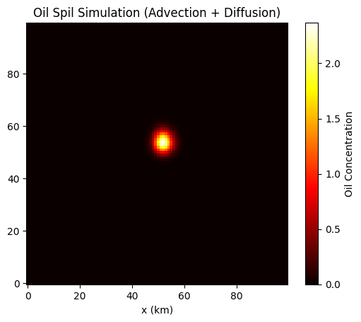

# Oil-Spill-Computational-Model

# Basic Oil Spill Computational Model
This Project simulates the spread of an oil spill over a simplified 2D ocean surface using a numerical **advection-diffusion model**. It's built with **python** and **Numpy** for educational purposes, focusing on clarity over complexity.

## 📑: Problem Statement
Model how an oil spill spreads over time on an ocean surface, considering:
- Intial spill at a point source
- Passive spreading (diffusion)
- Movement due to constant ocean currents (advection)

  We aim to understand how oil might disperse after a spill event and visulaize the evolving concentration field.

  ---

## 📐: Model Description

  We solve the 2D **advection-diffusion equation**: ∂C/∂t = D(∂²C/∂x² + ∂²C/∂y²) - u ∂C/∂x - v ∂C/∂y
  
  Where:
  - `C(x, y, t)` is the oil concentration
  - `D` is the diffusion coefficient
  - `u, v` are constant current velocities (advection)

### Assumptions:
- Flat ocean surface (2D grid)
- No coastlines or obstacles
- Constant velocity field (uniform ocean current)
- No evaporation or degradation

---

## :gear: How It Works

1. The ocean surface is modeled as a **100x100 grid**.
2. An initial oil spill is placed at the center of the grid.
3. At each time step:
   - **Diffusion** spreads the oil evenly.
   - **Advection** transports the oil in the direction of current.
4. The result is visualized as a heatmap of oil concentration.

---

## :hammer_and_wrench: Tech Stack

- Python 3.x
- NumPy
- Matplotlib

---

## :rocket: Getting Started
1. Clone the repository:
   ```bash
   git clone https://github.com/your-username/oil-spill-model.git
2. Create a Directory:
   ```bash
   cd oil-spill-model
3. Install required requirements:
   ```bash
   pip install -r requirements.txt
4. Run the code:
   ```bash
   python src/model.py

---

## 📊: Ouput




You’ll get a 2D heatmap like this:

- Red = High oil concentration
- Yellow = Medium
- Black = Zero

This helps visualize how the oil spreads and moves under influence of currents and diffusion.

---

## 🤔: Future Work
- Add real-time ocean current data
- Model coatlines and barriers
- Include evaporation and chemical breakdown
- Implemet in 3D

---

## 📜: License
MIT License

---

## 🤝: Contributions
Contributions are welcome! Open an issue or submit a pull request for enhancements or fixes.

---

##📫: Contact
Created with curiosity by R Ramya.
If you're interested in ocean modelling or enviornmental simulations, connect with me!

---
